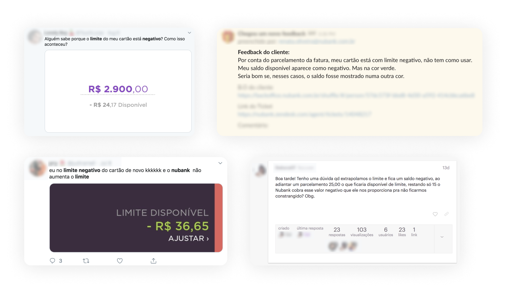
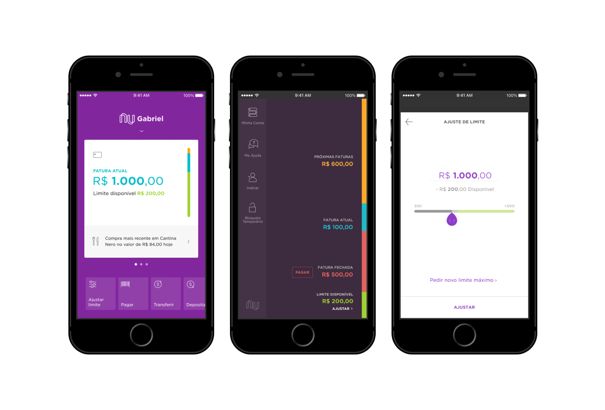
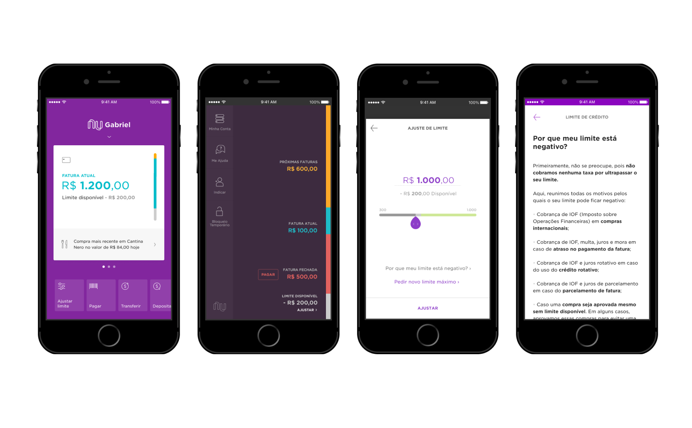

## Context
One of the roles of a product designer is to identify possible problems in an experience. And one way that I had to observe the clients’ feedback was to look at user comments on social media, customer service chat, or on the company's public forum. In one of these searches, I was able to observe a pattern of questions about the credit card limit – which was the squad I worked for.

## Problem
Credit cards can be a useful tool for building credit and making larger purchases. However, it is common for customers to not fully understand how credit cards work (or, in this case, how the company explained how credit card limits work), which can lead them to spend more than they can afford. 

My team and I were looking for small improvement projects that could have a positive impact, and we understood that this initiative could meet what we were looking for. In this case, I explain a little bit about a quick win experience that could completely solve the doubts that our users had.

## *Discover* Research
I selected a few customers’ comments who asked why their credit card limit was negative. These comments are from Facebook, Twitter, Nu Community(the company's forum), and customer service chat. And I found these doubts:

- **Why my credit card limit is negative?**
- **How can I have a negative limit since it isn't possible to exceed the limit?**
- **Can I still use my credit card?**
- **If it’s negative, why this information shows in green color?**
- **Why is the label “available limit” since it's negative?**

## *Define* Research: Scenarios
But after all, what is the negative limit? I didn't understand it, and I didn't even know when it was in this status.From that point, I asked about this issue some stakeholders on this topic, and I discovered the following information below:

### Negative limit for Overlimit
These are cases where the customer had a low limit and made a purchase. The system identifies the need, and in exception, it ends up approving the transaction.

### Negative limit for adjustment in the app
Those are simpler. As the customer can adjust the limit bar in the app, if they spent more than what is adjusted, the limit may appear as negative. Example: The customer has a pre-approved limit of 1000 BRL. They have already spent 500 BRL, but they accessed the app and left it set at 300 BRL. This will make the limit negative at 200 BRL.

### Negative limit for installments payments
If the customer has his bill in installments, whether manual or mandatory, the interest will compromise the limit.

### Negative limit for interest, fine, or FTT
This is very similar to the previous case. If the customer is late on a previous bill, paid late, or made international purchases, the interest, fine, or FTT compromise the limit, which may leave it negative.

### Negative limit for temp limits
When a customer receives a limit temporary increase reactive, they have a limit above their definitive limit for a period. Thus, when this period ends, the limit is again lower than the temporary limit, and the limit will become negative.

### Negative limit for emergencial limit
Similar to temp limit, the limit stays above the permanent for a set amount of time. And so when it goes back to its perm, it goes negative.

### Negative limit for Rewards program
When the customer limit is below normal, and there is a charge for the Rewards program subscription, the limit becomes negative.

## Problem
After I did the secondary research and understand the scenarios that existed for the limit to go negative, I was able to come to the conclusion that **the problem was that customers couldn’t understand their limit because we didn't explain it at any time it and the graphic elements used in the application were confusing.** Therefore, it was necessary to list some hypotheses to direct an idea.

## *Develop* Hypothesis
### Experience
The color green refers to a positive limit. Switching to another color, such as red, will remove the impression that it is a possible limit to use.

Customers don't understand why it's negative, as there is no explanation of why this happened. The ideal form is to inform why the limit is negative somewhere in the experience, explaining the exact reason for this and how the customer can make it positive again.

### Content
By changing the text from “Limit available” to another title that is more neural (eg “Limit value"), we can make it easier to understand.

## Solution
From the hypotheses raised, I created the following solutions:
Changed the color green to grey. At first, I thought of using red, but it was already being used to indicate a closed bill.

Added a button that only appeared when the limit became negative to explain why.

We have included a page in the FAQ page dedicated to including the reasons. At first, I'd like to display the exact reason, but that would add complexity and take longer to implement, so I ended up deciding to go with the simpler path.

## *Deploy* Results
After implementing the above changes, we continued to follow on the same channels and **didn’t get any more questions about this topic**. We understand that the changes applied met what we were looking for at that time, but that in the future new improvements could be applied.

## Takeaways
The routine of a digital product that is already in progress is quite different than a new product that has not yet gone live. Some professionals have already worked on the team you are working and they didn’t always predict (because we can't predict everything!) all the possible problems.

Often being in an intense routine of a product, the designer does what gives a faster return and becomes a process of continuous improvement - as was my case with this project.

As learnings, I believe that secondary research can greatly help to understand the voice of the client for timely improvements or before having a more in-depth research on the subject. Often we have the answers "in-house" and normally, we don't use the tools we have in our favor and it was fundamental to the success of this project.