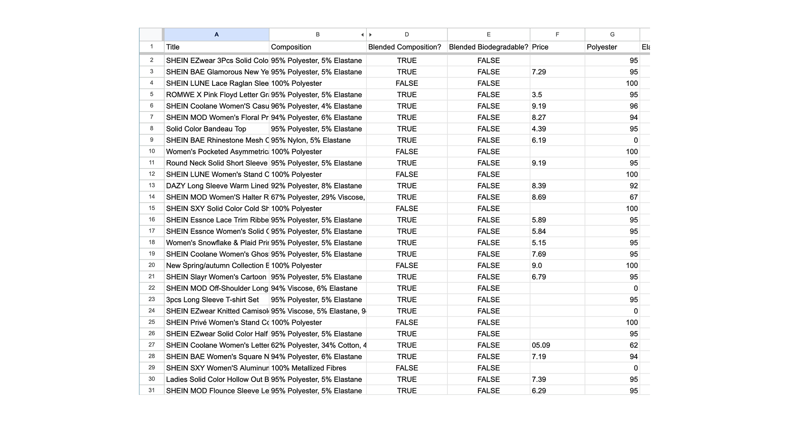
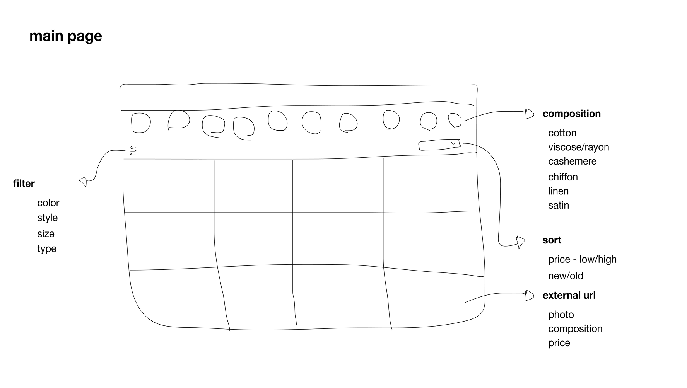
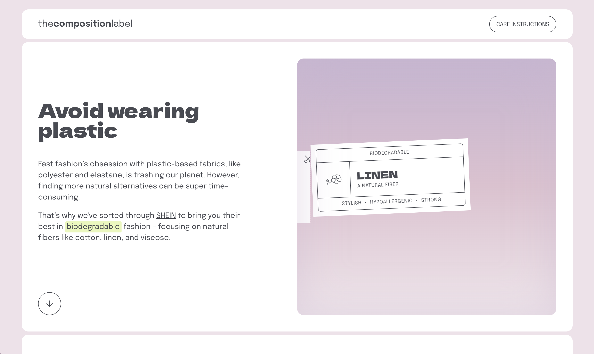
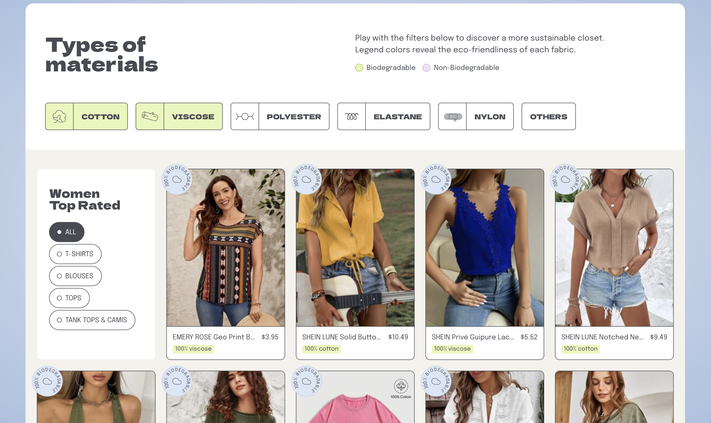
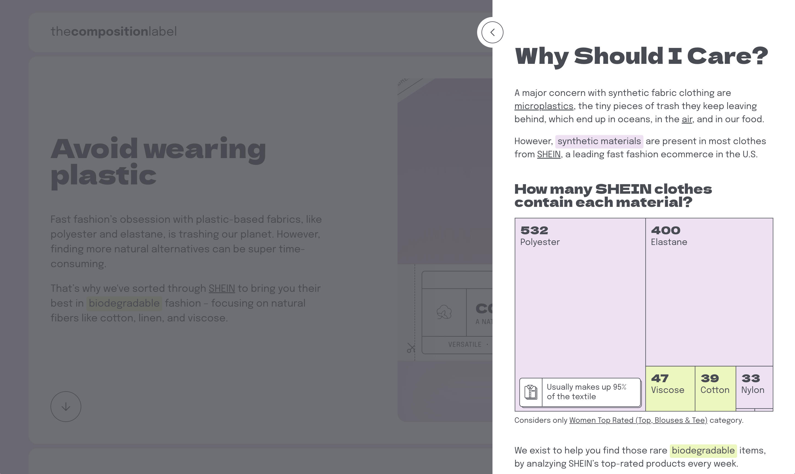
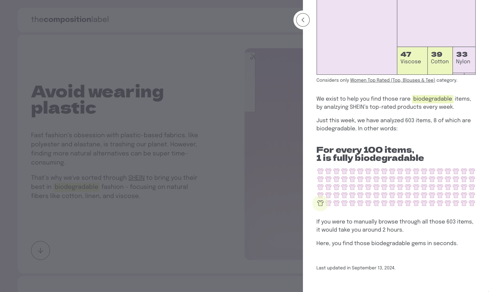

<!-- - Timeline
  - Jan, 2024

- Disciplines
  - Design
  - Data

- Responsibilities
  - Data Analysis
  - Design Thinking
  - Wireframing
  - UI Design

- Team
  - Designer (Mariana)
  - Developer (Vinicius)

- Tools
  - Google Sheets
  - Figma
  - Python
  - Svelte -->

## Context

I've always liked buying clothes from SHEIN. It's a way to buy different pieces at an affordable price, but one thing has always bothered me when buying these clothes: the material.

To keep the price low, SHEIN's clothes don't have long durability. After a few washes, the item gets full of pills or faded. So, I made the decision to change my wardrobe.

## Problem

In search of fresher and more durable pieces, I looked for more natural clothes on the website, and that's when I realized I couldn't filter correctly. Neither the website nor the app showed a filter dedicated to the composition of the clothes. They allow filtering by material, but the material and composition aren't always the same thing.

The truth is that SHEIN has such an extensive catalog, and the categorization has gotten a bit lost over time, but I also noticed that it was hard to find natural materials, as there were many polyester pieces.

And in these searches, I came up with **two hypotheses**: the first was that I thought **at least 90% of the clothes from SHEIN were made from plastic derivatives** – polyester, polyamide, etc., and the second was that **the company didn’t seem very willing to showcase pieces made from natural materials**, as the vast majority weren't made from these materials.

## Goals
The challenge was to create an experience where it would be possible to filter SHEIN pieces by the composition of biodegradable fabrics. Additionally, as an opportunity, display data on the number of biodegradable pieces and the time the user would need to search for these clothes on the website.

<!-- <video autoplay muted loop playsinline>
  <source src="../assets/images/cases/the-composition.mp4" type="video/mp4">
</video> -->

<!-- - 
---
- *Desafio* Criar um site onde fosse possível filtrar as peças da SHEIN por composição de tecidos biodegradáveis.
- *Oportunidade* Exibir dados de quantas de peças que são biodegradáveis e quanto tempo o usuário precisaria procurar no site para ter acesso a essas roupas.
-->

<!-- - 1. Discover
  - Identify Problem
  - Data Analysis
1. Define
  - Solution Ideation
  - Low Fidelity
1. Develop
  - Final Design

-->

## Process

### *Discover* Searching for answers

Considering my hypotheses, I decided to go after answers. With a website that has approximately 600,000 items for sale (according to the BBC - incluir dado), it became unfeasible to analyze all the clothes, so I needed a sample that would represent the whole. In this case, I selected a base from the 'Best-Selling Women's Clothes – Tops, Blouses, and T-shirts' page. I chose this segment because, although SHEIN didn't release a report on the best-selling items, I analyzed which pieces appeared most frequently as 'Best-Selling' and concluded that it was women's tops.

So, together with Vini (front-end developer), we did a scraping of the sample. After having access to the .csv file, I exported it to Google Sheets.

### Sample analyzed

After accessing the data on the pieces, I was able to confirm some of my hypotheses and other curiosities: **Over 90% of the clothes are made of polyester.**

Additionally, I noticed that it was more common to find a blend of materials, so to be more precise, **95% of the clothes are made of a combination of polyester and elastane.**

It's so difficult to find a biodegradable piece on the website that **a user would normally take about 2 hours to find just 8 items.**

### *Define* Brainstorming a solution

So, with relevant data in hand, it was now time to think of a solution. My objectives were to make it easier to find these biodegradable pieces and to bring a reflection on the data used, such as insights into how SHEIN produces its clothes and how difficult it is to access natural pieces.

So, I decided to create a website like a composition label, where it would be possible to filter clothes by specific materials, as well as provide general data about their compositions.

### *Develop* Final delivery

[Check it live](https://thecompositionlabel.com/)